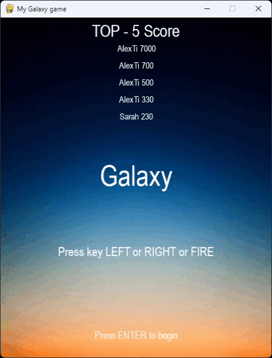

# Game Galaxy  

Children's game "Galaxy" written using "pygame". 

🎮🕹️💥🚀💣


## Installation libraries:


```python
pip install pygame
```
or
## Install the required packages:

```python
pip3 install -r requirements.txt
```
    
## Screenshots




## In-game bonuses


 - Adds one life

 - Adds energy

 - Explodes all mobs on the map

 - An assistant appears for a while

 - Enhanced shooting for a while

 - Three-way shooting for time
## Table of records

- The table of records is implemented using ".json"

```python

from os import path
import json

def save(highscores):
    with open('highscores.json', 'w') as file:
        json.dump(highscores, file)  # Write the list to the json file.
def load():
    try:
        with open('highscores.json', 'r') as file:
            highscores = json.load(file)  # Read the json file.
    except FileNotFoundError:
        return []  # Return an empty list if the file doesn't exist.
    # Sorted by the score.
    return sorted(highscores, key=itemgetter(1), reverse=True)

```